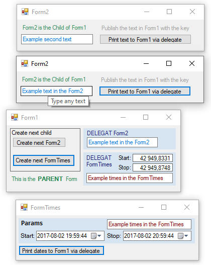

# WinForm Delegate
The project shows how the 'delegate' mechanism works.
A descendant form called by a parent, normally cannot call the parent's methods. Thanks to the delegate mechanism, it can do so. A delegate is a reference to the parent method. Form1 initializes Form2 and passes it a reference to its method 'jDelegatPrintFromForm1()' Form2 presses its key and writes its text in Form1.

## Details
VS2019 and Target Framework: .NET Framework 4.5.

